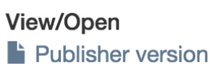
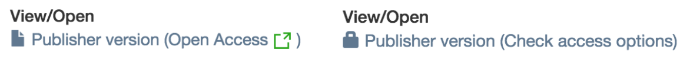

This README contains the suggested Wiki documentation for the renewed PR for [DS-2877](https://jira.duraspace.org/browse/DS-2877).

Atmire advises to remove the following pages from the Wiki as this documentation replaces them:

* [DSDOC6x/2016+Framework+for+live+import+from+external+sources](https://wiki.duraspace.org/display/DSDOC6x/2016+Framework+for+live+import+from+external+sources)
* [DSPACE/DSpace+Elsevier+API+integration](https://wiki.duraspace.org/display/DSPACE/DSpace+Elsevier+API+integration)

---

# External Source Import

< Table of Contents >


## Introduction

External Source Import is an optional feature that may be enabled for use within a DSpace repository. 
The framework offers enhancements to leverage external APIs for enriching the repository and has 4 main components:

* Creating/updating items with prepopulated fields using metadata from an external API.
* Showing the publisher version of the item on the item display page
* Advertising an imported item's Open Access status
* Embedded viewing of a publication (e.g. a Publisher's article version)

Please note that the functioning of each of these components largely depends on whether a particular API supports them AND whether that specific API has been implemented properly in the framework. For instance, an API might support fetching metadata while disallowing embedded viewing.

## Functionality overview

The following sections describe the **default** behavior and functionality of the different components of the External Source Import framework.

### Out-of-the-box external sources

The External Source Import framework is featured by the following APIs out of the box:

* ScienceDirect
* Scopus
* PubMed

### Import metadata during manual submissions

The submission process will be extended with two additional steps: **Import Source** and **External Source Import**

In the **Import Sources** step the user will be presented with a dropdown to choose the import source from, i.e. the API to search in. If a manual submission should be made, importing can be skipped by clicking the "Skip Import" button.

The **External Source Import** step allows the user to search and import a publication from the previously chosen import source. Fill in at least one of the presented search fields and click on "Search". In the Mirage theme, the search results will be presented after a page reload. In Mirage2 a modal will appear on the current page instead. After a publication has been selected for import, its title and authors are shown at the bottom of the current step. Publications that are already imported are shown with a grayish background (_Mirage 2 only_). Already imported publications can only be detected for the same external source.

### Batch import metadata

An **External Source Import** menu link will be available in the administrative sidebar, allowing administrators to import multiple items at once. Just as with importing during submission, the administrator is presented with a dropdown to choose the import source from, followed by search fields to query the corresponding API. After selecting the desired items, the final handler should be chosen:

|Action|Description|
|------|-----------|
|Select collection|The collection to which all currently selected items should be sent to.|
|Send imported items to workspace|Import the currently selected items as unfinished submissions of the current user.|
|Send imported items to workflow|Import the currently selected items to the selected collection but adhere to the configured workflow if applicable.|
|Archive imported items|Import the currently selected items to the selected collection and immediately archive them, hereby ignoring any configured workflow.|

### Bitstreams on item display page

The framework will **never** download an item's file to the local assetstore. A dynamically added bitstream entry will be shown on the item display page instead, linking out to the corresponding webpage of the external source, e.g. the Publisher's article page. This way a DSpace repository can safely contain restricted metadata items as interested users will get redirected to the Publisher, allowing them for example to swiftly make use of their institution's subscription to get hold of the publication.



### Publication entitlement (Open Access)

> **Important note:** The entitlements implementation is currently hardcoded to support ScienceDirect, Scopus and PubMed only. Extending this part of the code towards a hookable system, allowing custom APIs to make use of the entitlements feature as well, is put on the roadmap and will be implemented in a next release.

Most publishers own the rights to the articles in their journals. Anyone who wants to read the articles must pay to access them. Anyone who wants to use the articles in any way must obtain permission from the publisher and is often required to pay an additional fee. Through Open Access, the results of publicly funded research are freely available online and do not have to be bought (back) from the publishers by the scientific and scholarly institutions.

If the external API supports getting information about the publication's Open Access status, this information can be queried and shown next to the outgoing Publisher link.



The following scenarios are possible:

|Availability|Label|
|------------|-----|
|Open Access|**Open Access**<br />The user can immediately download the publication on the Publisher website.|
|Open Access but under embargo|**Check access options**<br/>The user is encouraged to check the access options on the Publisher website as he might be able to access the publication anyway (e.g. by means of an institutional subscription). |
|Paid Access|**Check access options**<br/>The user is encouraged to check the access options on the Publisher website as he might be able to access the publication anyway (e.g. by means of an institutional subscription). |

Entitlements are fetched asynchronously through Javascript after an item page is loaded. If you experience CORS-related problems, please consider the following [note](http://dev.elsevier.com/tecdoc_sd_ir_integration.html) (applies to ScienceDirect and Scopus only):

> The Article Entitlement Retrieval API should be called from user's browser by integrating it directly with the IR's web page via JavaScript. In order to comply with cross-origin security policy, we will ensure that your IR's domain is added to the API key configuration to enable W3C CORS support. You can request to add IR domains by emailing Elsevier integrationsupport your API key and a list of authorized domains.

### Embedded viewing of a publication

> **Important note:** The embedded viewing implementation is currently hardcoded to support ScienceDirect, Scopus and PubMed only. Extending this part of the code towards a hookable system, allowing custom APIs to make use of embedded viewing as well, is put on the roadmap and will be implemented in a next release.

If the external API supports streaming files for embedded viewing, this feature can be enabled. Open Access publications won't link out anymore to the Publisher website but will render an embedded viewer so the user can immediately start reading. When access to the publication is denied, a check will occur to verify if the record is under embargo. If the record is not under embargo, the Accepted Manuscript will be loaded on the embed page instead of the full text publication.

## Enabling External Source Import (XMLUI)

> The External Source Import framework is available for the XMLUI only.

### Import metadata during manual submissions

For users to see the **Import Sources** and **External Import Source** steps at the start of a new submission, uncomment the `submit.progressbar.sourcechoice` and `submit.progressbar.sourceimport` steps in `dspace/config/item-submission.xml` and make sure they appear before the *Describe Metadata* steps:

```
<step>
   <heading>submit.progressbar.sourcechoice</heading>
   <processing-class>org.dspace.submit.step.SourceChoiceStep</processing-class>
   <xmlui-binding>org.dspace.app.xmlui.aspect.submission.submit.SourceChoiceStep</xmlui-binding>
   <workflow-editable>true</workflow-editable>
</step>

<step>
   <heading>submit.progressbar.sourceimport</heading>
   <processing-class>org.dspace.submit.step.SourceImportStep</processing-class>
   <xmlui-binding>org.dspace.app.xmlui.aspect.submission.submit.SourceImportStep</xmlui-binding>
   <workflow-editable>true</workflow-editable>
</step>

<step>
   <heading>submit.progressbar.describe</heading>
    ...
</step>

```

#### File upload step

**File upload requirement**

By default the file upload step requires at least one file to be uploaded before a submission can be completed. Due to a publication link being added automatically when an item has been imported from an external API, requiring new bitstream may not always be applicable. This requirement can be disabled in the DSpace configuration file  `[dspace]/config/dspace.cfg`:

```
webui.submit.upload.required = false
```

**Automatic embargo**
> **Important note:** The File Upload step changes are currently hardcoded to support Elsevier only. Extending this part of the code towards a hookable system, allowing custom APIs to make use of the this feature as well, is put on the roadmap and will be implemented in a next release.

The File Upload step can automatically be enhanced to suggest file permissions based on the information supplied by an external API. These file upload customizations can be enabled in `[dspace]/config/modules/external-sources/elsevier.cfg` as follows:

```
external-sources.elsevier.file.access.enabled = true
```

#### Batch import metadata

Batch Import functionality is enabled by default! If you would like to remove this feature, open `[dspace]/config/xmlui.xconf` and comment out the following aspect:

```
<aspect name="ExternalImport" path="resource://aspects/ExternalImport/" />
```

Be sure to also remove the corresponding entry from the navigation menu defined in `org.dspace.app.xmlui.aspect.administrative`.

#### Entitlements

To enable the Entitlements functionality, open `[dspace]/config/xmlui.xconf` and uncomment the following aspect:

```
<aspect name="ElsevierEntitlement" path="resource://aspects/ElsevierEntitlement/" />
```

#### Embedded viewing

> **Important note:** Reports related to malfunctioning HTTPS calls are currently under investigation. Embedded Viewing should be fully functional on HTTP. If you run into any HTTPS or SSL certificate related errors, please bear with us.

To enable the Embedded Viewing functionality, open `[dspace]/config/xmlui.xconf` and uncomment the following aspects:

```
<aspect name="ElsevierEntitlement" path="resource://aspects/ElsevierEntitlement/" />
<aspect name="ElsevierEmbed" path="resource://aspects/ElsevierEmbed/" />
```

### Firewall verification

The server should be able to reach the enabled APIs. For the default APIs, this can be verified easily using the following commands:

```
curl -Is http://api.elsevier.com/ | head -1
curl -Is http://eutils.ncbi.nlm.nih.gov/ | head -1 
```

If *any* HTTP status code is returned you can reach the specified URL properly (even though it's a 403 or 500). If nothing is returned, the server is not able to reach the URL. Please verify whether the firewall is configured to authorize outgoing connections.

### ScienceDirect & Scopus

The External Import Source framework will have PubMed enabled by default, but also has an out-of-the-box integration with [ScienceDirect](http://www.sciencedirect.com) and [Scopus](https://www.scopus.com). These APIs are protected with user accounts and keys to avoid abuse by robots and malicious users. To register for an API key, follow this two-step approach:

1. Get hold of an API key. Go to [this page](https://dev.elsevier.com/apikey/create) to create a new key. If your institution already has a Scopus API key, you can submit your Scopus API key to have the settings for the ScienceDirect API services added.

1. Register for the Institutional Repository Program. Go to [this page](https://www.elsevier.com/solutions/sciencedirect/forms/institutional-repository-managers?rURL=Direct) to submit your API key.

1. The Elsevier integration support team will add the ScienceDirect Institutional Repository settings to your API key and confirm back.

Further support for the API key registration process is available from [integrationsupport@elsevier.com](mailto:integrationsupport@elsevier.com)

More information about the Institutional Repository Program and the corresponding policies can be found on [http://dev.elsevier.com/ir_cris_vivo.html](http://dev.elsevier.com/ir_cris_vivo.html)

To enable ScienceDirect and/or Scopus support in DSpace, add your API key in `[dspace]/config/modules/external-sources/elsevier.cfg`, or define it in your Maven build profile as `<external-sources.elsevier.key>`.

```
external-sources.elsevier.key = ${external-sources.elsevier.key}
```

Lastly, uncomment the corresponding entries in Spring configuration, found in `[dspace]/config/spring/api/general-import-service.xml`:

```
<util:map id="ImportServices">
    <entry key="science" value-ref="ScidirImportService"/>
    <entry key="scopus" value-ref="ScopusImportService"/>
    <entry key="pubmed" value-ref="PubmedImportService"/>
</util:map>
```

## Configuring the External Import framework

### Configuration overview

Configurations related to the External Source Import framework and specific integrations can be found in the `[dspace]/config/modules/external-sources` folder. This folder contains a separate configuration file for each external API and also one file for the generic Elsevier configurations. 

**elsevier.cfg**

| Property | Description | Default 
| -------- | ----------- | -------|
|`external-sources.elsevier.key`| Elsevier API key. You can either fill out the API key manually or include in your Maven/Puppet/Ansible configuration profiles. |${elsevier.api.key}
|`external-sources.elsevier.api.article.url`| The base URL for the retrieval of an article. The default value should probably be left untouched. |http://api.elsevier.com/content/article
|`external-sources.elsevier.ui.article.url`| The base URL for retrieval based on Elsevier PIIs. The default value should probably be left untouched. |http://www.sciencedirect.com/science/article
|`external-sources.elsevier.entitlement.url=`| The base URL for the retrieval of identifiers and the entitlement status. The default value should probably be left untouched. |http://api.elsevier.com/content/article/entitlement
|`external-sources.elsevier.embargo.url=`| The base URL for the retrieval of the embargo status associated with a publication. The default value should probably be left untouched. |http://api.elsevier.com/content/article/hostingpermission
|`external-sources.elsevier.entitlement.check.enabled`| Whether an article's entitlement (access options) should be fetched for the current user. |true
|`external-sources.elsevier.file.access.enabled`| Whether the file upload step Elsevier integrations should be enabled. |true
|`external-sources.elsevier.metadata.field.pii`| The metadata field holding the PII value. Used for entitlement retrieval and embedded viewing. |elsevier.identifier.pii
|`external-sources.elsevier.metadata.field.doi`| The metadata field holding the DOI value. Used for entitlement retrieval and embedded viewing. Multiple fields can be added, separated by a comma. |elsevier.identifier.doi,dc.identifier
|`external-sources.elsevier.metadata.field.eid`| The metadata field holding the EID value. Used for entitlement retrieval and embedded viewing. |elsevier.identifier.eid
|`external-sources.elsevier.metadata.field.scopus_id`| The metadata field holding the Scopus ID value. Used for entitlement retrieval and embedded viewing. |elsevier.identifier.scopusid
|`external-sources.elsevier.metadata.field.pubmed_id`| The metadata field holding the PubMed ID value. Used for entitlement retrieval and embedded viewing. |elsevier.identifier.pubmedid
|`external-sources.elsevier.embed.display`| Whether publisher versions should be embedded for viewing within the repository. If false, the user is redirected to an off-site Elsevier website. |false
|`external-sources.elsevier.embed.display.width`| The width of the embed frame (in px) in case `embed.display` is set to true. |700
|`external-sources.elsevier.embed.display.height`| The height of the embed frame (in px) in case `embed.display` is set to true. |500
|`external-sources.elsevier.embed.link.position`| Whether the link to the publisher version should be rendered above or below the file section on the item page. Should either be `top` or `bottom`. |top

**scidir.cfg**

| Property | Description | Default 
| -------- | ----------- | -------|
|`external-sources.scidir.url`| The base URL for the interacting with ScienceDirect's API. The default value should probably be left untouched. |http://api.elsevier.com/content/search/scidir

**scopus.cfg**

| Property | Description | Default 
| -------- | ----------- | -------|
|`external-sources.scopus.url`| The base URL for the interacting with Scopus' API. The default value should probably be left untouched. |http://api.elsevier.com/content/search/scopus
|`external-sources.scopus.view`| The Scopus view to use for retrieving results. Should either be `STANDARD` or `COMPLETE`. Only set to `COMPLETE` if your Elsevier API key allows the use of the Scopus COMPLETE view. Please refer to the [API description](http://api.elsevier.com/documentation/search/SCOPUSSearchViews.htm) for more information. |STANDARD

**pubmed.cfg**

| Property | Description | Default 
| -------- | ----------- | -------|
|`external-sources.pubmed.url`| The base URL for the interacting with PubMed's API. The default value should probably be left untouched. |https://eutils.ncbi.nlm.nih.gov/entrez/eutils/


### API field mapping

In case you have a custom metadata schema and/or fields, you might want to update the field mappings in order for your custom fields to be populated automatically after publication imports. The `[dspace]/config/spring/api/scidir-service.xml`, `[dspace]/config/spring/api/scopus-service.xml` and `[dspace]/config/spring/api/pubmed-service.xml` files contain the Spring configuration for the beans used by the corresponding integrations. To set up a custom field mapping, follow these steps.

1. In `[dspace]/config/spring/api/general-import-services`, the DSpace metadata field that should be populated (e.g. `dc.title`) must be configured as a Spring bean *if this is not already the case*.
   
   ```
   <bean id="[MAPPED_FIELD_ID]" class="[CLASS]">
       <constructor-arg value="[DSPACE_FIELD]"/>
   </bean>
   ```
   | Placeholder         | Value
   | ------------------- | ------
   | `[MAPPED_FIELD_ID]` | The bean ID to be referenced later. E.g. `dcTitle`.
   | `[CLASS]`           | `org.dspace.importer.external.metadatamapping.MetadataFieldConfig`
   | `[DSPACE_FIELD]`    | The DSpace metadata field to populate. E.g. `dc.title`.

2. In `[dspace]/config/spring/api/general-import-services`, an additional Spring bean should be created to define which API value to use for populating the mapped field.
   
   ```
    <bean id="[VALUE_MAPPING_ID]" class="[CLASS]">
        <property name="field" ref="[MAPPED_FIELD_ID]"/>
        <property name="query" value="[XPATH]"/>
    </bean>
   ```
   
   | Placeholder          | Value
   | -------------------- | ------
   | `[VALUE_MAPPING_ID]` | The bean ID to be referenced later. E.g. `titleContrib`.
   | `[CLASS]`            | `org.dspace.importer.external.metadatamapping.contributor.SimpleXpathMetadatumContributor`
   | `[XPATH]`            | The xpath expression used to fetch the API value from an XML response. The root for the query is the "entry" element. E.g. `dc:title`.
   
3. In `[dspace]/config/spring/api/scidir-services` (or the corresponding file of the import source of your choice), an entry should be added to the `scidirMetadataFieldMap` (or similar in case of another import source).
   
   ```
    <util:map id="scidirMetadataFieldMap" ...>
        ...
        <entry key-ref="[MAPPED_FIELD_ID]" value-ref="[VALUE_MAPPING_ID]"/>
        ...
    </util:map>   
   ```
   
   | Placeholder          | Value
   | -------------------- | ------
   | `[MAPPED_FIELD_ID]`  | The ID of the mapped field bean, defined earlier.
   | `[VALUE_MAPPING_ID]` | The ID of the value mapping bean, defined earlier.
   
**Combining API values into one field**

In case the populated value should be constructed from multiple API values, step 2 of the described process should be expanded to the following:

1. First, define all value mapping beans for the different pieces. Note that `[MAPPED_FIELD_ID]` is the same for both beans.

    ```
    <bean id="[INTERMEDIARY_VALUE_MAPPING_ID_1]" class="[CLASS]">
        <property name="field" ref="[MAPPED_FIELD_ID]"/>
        <property name="query" value="[XPATH_1]"/>
    </bean>

    <bean id="[INTERMEDIARY_VALUE_MAPPING_ID_2]" class="[CLASS]">
        <property name="field" ref="[MAPPED_FIELD_ID]"/>
        <property name="query" value="[XPATH_2]"/>
    </bean>
    ```

2. Then create a new Spring list containing references to the intermediary value mapping beans.

    ```
    <util:list id="[COMBINED_MAPPING_ID]" value-type="[CLASS]" list-class="java.util.LinkedList">
        <ref bean="[INTERMEDIARY_VALUE_MAPPING_ID_1]"/>
        <ref bean="[INTERMEDIARY_VALUE_MAPPING_ID_2]"/>
    </util:list>
    ```
    
    | Placeholder            | Value
   | ----------------------- | ------
   | `[COMBINED_MAPPING_ID]` | The bean ID to be referenced later. E.g. `combinedAuthorList`.
   | `[CLASS]`               | `org.dspace.importer.external.metadatamapping.contributor.MetadataContributor`

3. Finally create the value mapping bean while providing the Spring list.

    ```
    <bean id="[VALUE_MAPPING_ID]" class="[CLASS]">
        <property name="separator" value="[SEPARATOR]"/>
        <property name="metadatumContributors" ref="[COMBINED_MAPPING_ID]"/>
        <property name="field" ref="[MAPPED_FIELD_ID]"/>
    </bean>
    ```
    
   | Placeholder          | Value
   | -------------------- | ------
   | `[VALUE_MAPPING_ID]` | The bean ID to be referenced later. E.g. `authorContrib`.
   | `[CLASS]`            | `org.dspace.importer.external.metadatamapping.contributor.CombinedMetadatumContributor`
   | `[SEPARATOR]`        | The string to use for separating the combined values. E.g. `, `.
   | `[COMBINED_MAPPING_ID]` | The ID of the list bean, defined earlier.
   
## Update script

An update script is available to accommodate for changes in previously imported items. This scripts enables the possibility to use a PII or DOI to re-check an item for possible updates in file permissions, identifiers and metadata. This check is done against the originally used source API and uses the same configuration.

The script can be run using the following command in the `[dspace]` directory:

```
[dspace]/bin/dspace dsrun org.dspace.importer.external.scidir.UpdateElsevierItems
```

Here's an overview of the available options to specify which items need to be updated:

| Option | Description 
| -------- | -----------
| `-t`<br />`--test` | Only test the changes done by the script.
| `-f`<br />`--force` | Forcefully update.
| `-a`<br />`--assignpii` | Resets the current PII with the one fetched from the API.
| `-p`<br />`--permissions` | Adjust Bitstream permissions with those fetched from the API. Only applies to Bitstreams for which permissions were not manually overruled.
| `-m`<br />`--metadata` | Adjust metadata values with those fetched from the API. Only takes effect when used in conjunction with `--force`. Note that manually entered metadata will be overridden!
| `-i`<br />`--item` *123456789/99* | If provided, the script will only be run for the provided handle. If omitted all archived items will be iterated.

