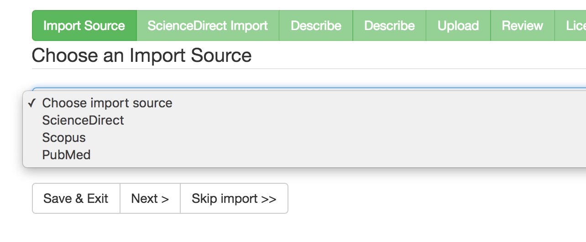

# Functionality overview

## Import during submission

Two steps will be added to the submission process. In the first step the user will be presented with a dropdown to choose the import source from, i.e. the API to search in. If a manual submission should be made, importing can be skipped by clicking "Skip Import" or not selecting an import source and clicking "Next" at the bottom of the page. 



The second step allows the user to search and import a publication from the previously chosen import source. Fill in at least one of the presented search fields and click on "Search". A new window will appear containing the search results. To import a publication click on the "Import" button next to it.


Publications that are already imported are shown with a grayish background in theme Mirage 2. Already imported publications are only detected for the same source. 
Theme Mirage does not show already imported publications differently.


When a publication is selected for import its title and authors are shown at the bottom of the import step:


Note that importing a publication removes any fields that were already added to the item.

## Batch import

The batch import functionality allows administrators to import multiple publications at once. The batch import page can be found by clicking on "Elsevier import" in the administrative menu, or by browsing to {dspace-url}/liveimport.

Just as with importing during submission, the administrator is presented with a dropdown to choose the import source from, followed by search fields.


After searching, a list of corresponding publications will be shown. A checkbox is available next to each publication to select it for import.


On the next page all publications that are selected for import are listed. Here you can choose what to do with the selected publications:

* Send imported items to workspace:  The items are added to the user's workspace ("Unfinished submissions").
* Send imported items to workflow: The items are added to the workflow to be reviewed by the reviewers of the collection the item is added to.
* Archive imported items: The items are archived immediately.

A collection to which the items are added must be selected from the "Select collection" dropdown.


## File upload access options

The file upload step has been altered to allow users to select the accessibility of files.


If you encounter the following warning message in the DSpace logs, please verify whether the permissions of your API key are sufficient to retrieve hosting permissions:

> Error retrieving required nodes from the response, please verify whether your ScienceDirect API key has sufficient permissions: APIKey XXXX with IP address X.X.X.X is unrecognized or has insufficient privileges for access to this resource

## Access indicator

The Elsevier [Entitlements API](http://api.elsevier.com/content/article/entitlement) is called asynchronously through Javascript after an item page is loaded to display Open Access status and access information on the item page.

If you experience CORS-related problems, please consider the following note (copied from [dev.elsevier.com/tecdoc_sd_ir_integration.html](http://dev.elsevier.com/tecdoc_sd_ir_integration.html))

> The Article Entitlement Retrieval API should be called from user's browser by integrating it directly with the IR's web page via JavaScript. In order to comply with cross-origin security policy, we will ensure that your IR's domain is added to the API key configuration to enable W3C CORS support. You can request to add IR domains by emailing Elsevier integrationsupport your API key and a list of authorized domains.

## Embedded PDF

If enabled, the link to the publisher version will redirect to an embed page on your repository directly displaying the corresponding PDF. When access to the PDF is denied, a check will occur to verify if the record is under embargo. If the record is not under embargo, the Accepted Manuscript will be loaded on the embed page instead of the full PDF. Otherwise, an outgoing link to the actual article on Elsevier's website will be rendered in case the item holds a valid PII or DOI.


## Update script

An update script is available to accommodate for changes in previously imported items. This scripts enables the possibility to use a PII or DOI to re-check an item for possible updates in file permissions, identifiers and metadata. This check is done against the originally used source API and uses the same configuration.

The script can be run using the following command in the `[dspace]` directory:

**DSpace 5**

```
[dspace]/bin/dspace dsrun com.atmire.script.UpdateElsevierItems
```

**DSpace 6**

```
[dspace]/bin/dspace dsrun org.dspace.importer.external.scidir.UpdateElsevierItems
```

Here's an overview of the available options to specify which items need to be updated:

| Option | Description 
| -------- | -----------
| `-t`<br />`--test` | Only test the changes done by the script.
| `-f`<br />`--force` | Forcefully update.
| `-a`<br />`--assignpii` | Resets the current PII with the one fetched from the API.
| `-p`<br />`--permissions` | Adjust Bitstream permissions with those fetched from the API. Only applies to Bitstreams for which permissions were not manually overruled.
| `-m`<br />`--metadata` | Adjust metadata values with those fetched from the API. Only takes effect when used in conjunction with `--force`. Note that manually entered metadata will be overridden!
| `-i`<br />`--item` *123456789/99* | If provided, the script will only be run for the provided handle. If omitted all archived items will be iterated.
